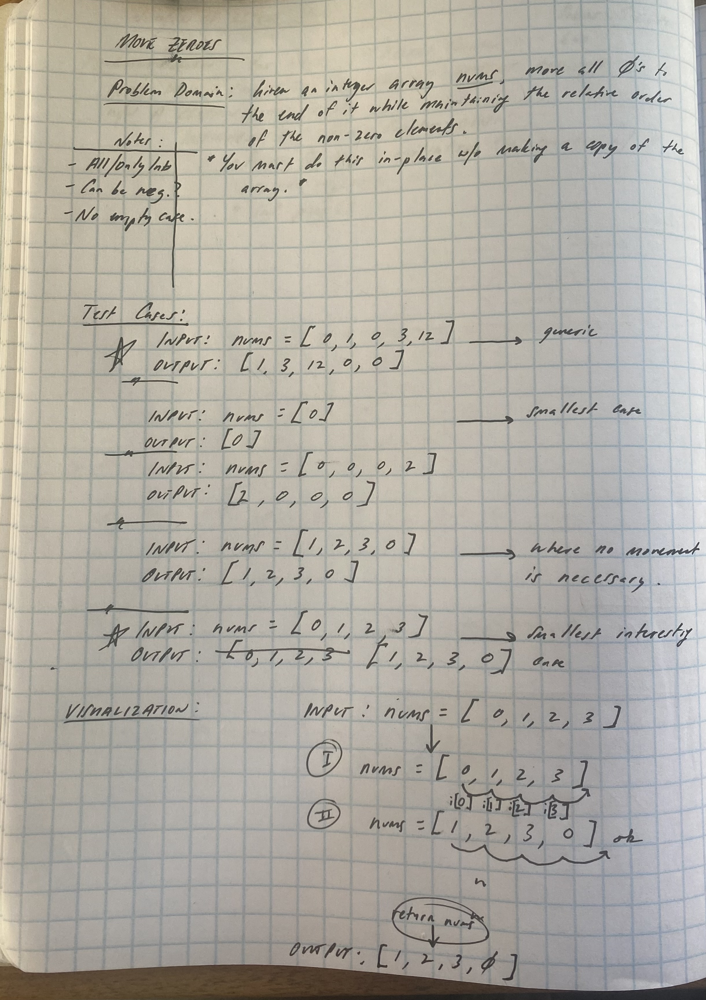
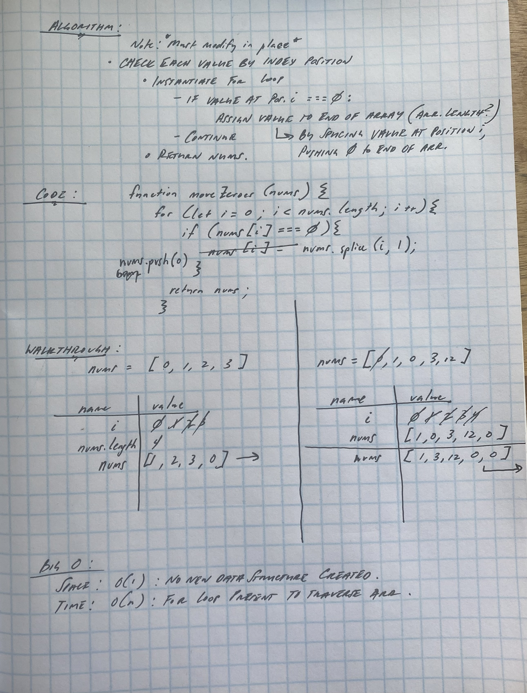

# Challenge: Move Zeroes

Problem Domain:

Given an integer array nums, move all 0's to the end of it while maintaining the relative order of the non-zero elements.

Note that you must do this in-place without making a copy of the array.

