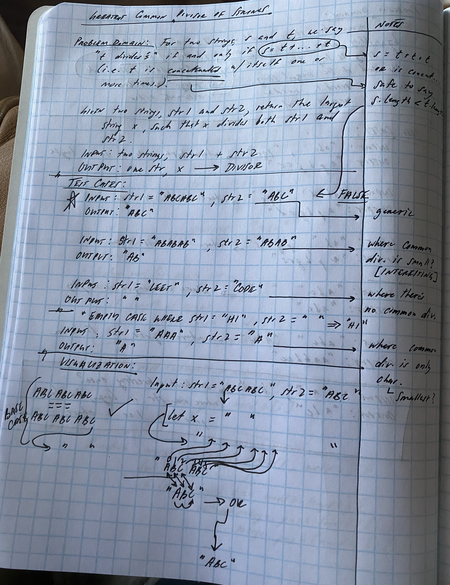
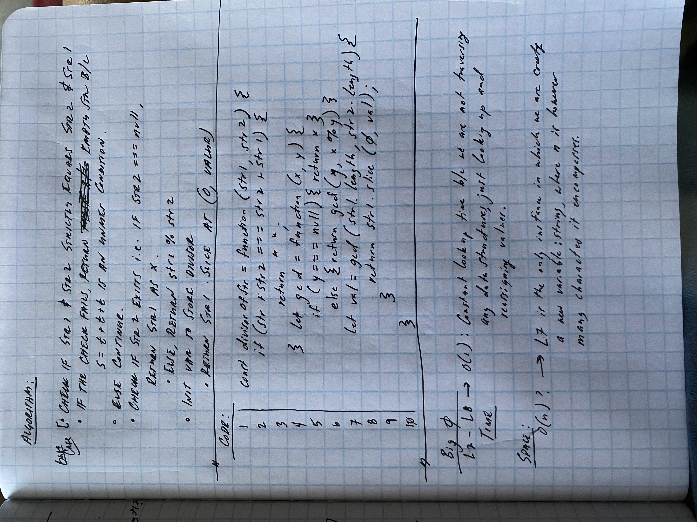

# Challenge: Greatest Common Divisor

Problem Domain: For two strings s and t, we say "t divides s" if and only if s = t + ... + t (i.e., t is concatenated with itself one or more times).

Given two strings str1 and str2, return the largest string x such that x divides both str1 and str2.

